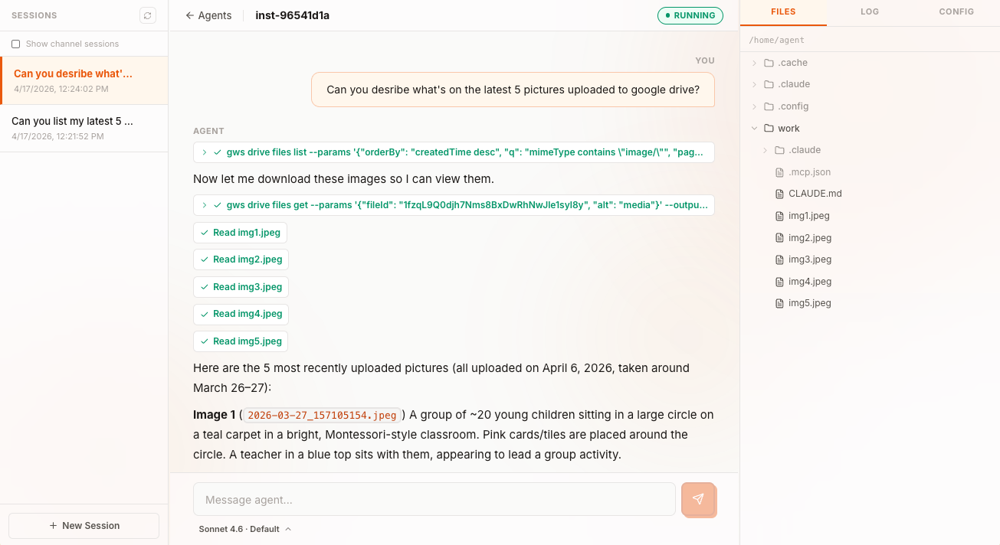

# Humr

```
 ╦ ╦╦ ╦╔╦╗╔═╗
 ╠═╣║ ║║║║╠╦╝
 ╩ ╩╚═╝╩ ╩╩╚═

 Run your own background agents on Kubernetes.
 Isolated by default. Credentialed. Always-on.
```

Keep your coding agents running when you close the lid. Ship them to your team. Sell them to your customers. Humr gives Claude Code, Codex, or Gemini CLI an isolated Kubernetes pod, a credential-injecting proxy, a scheduler, and a Slack channel.

## What you get

- **Zero-trust isolation** — Every agent runs in its own pod with its own filesystem, network, and credentials. Outbound traffic routes through a proxy that injects real API keys; the agent never sees them. Network policy drops everything else. A compromised agent has nothing to steal and nowhere to go.

- **Always-on scheduling** — Cron lives on the platform, not your laptop. Scheduled tasks look identical to human messages from the agent's perspective. Workspace and conversation history persist across restarts.

- **Slack-native channels** — One Slack app, unlimited agents. Per-thread routing, identity linking via `/humr login`, per-instance access control. Your agents live where your team already works.

- **Bring your own agent** — Claude Code ships as the default template. Codex, Gemini CLI, or anything that speaks [ACP](https://spec.agentcontrolprotocol.com) works too. No lock-in to one vendor's SDK or cloud.

<!-- TODO: replace with screenshot or demo video of a running agent session -->


## Guided Tour

```sh
git clone https://github.com/kagenti/humr && cd humr
```

Open your favorite AI coding agent in the repo and try:

```
Walk me through how Humr works step by step. I want to do a demo for myself.
Explain how things work on the way. Help me connect a model provider, create
an instance, add a connection to GitHub, and chat with an agent.
```

Once you're comfortable, go deeper:

```
Now show me the advanced stuff. Set up a Slack channel integration, create a
scheduled job, build a long-living agent with a heartbeat, and wire up an
MCP server.
```

Your agent has full context of the codebase, architecture decisions, and cluster commands.

## Quick Start

Prerequisites: [mise](https://mise.jdx.dev), Docker, macOS or Linux.

```sh
mise install                # install deps, configure git hooks
mise run cluster:install    # create local k3s cluster + deploy (or upgrade) Humr
mise run cluster:status     # check pods
export KUBECONFIG="$(mise run cluster:kubeconfig)" # activate cluster env
```

Open **`humr.localhost:4444`** in your browser (login: `dev` / `dev`), create an instance from a template, and start chatting.

## Learn more

- **[Operations guide](docs/operations.md)** — credential setup (OneCLI), Slack integration, development workflow, architecture overview
- **[Why Humr exists](PITCH.md)** — the three problems every agent hits in production, how Humr solves each, and a 5-minute walkthrough
- **[Motivation](MOTIVATION.md)** — why Humr exists, the three abstraction levels, design beliefs
- **[Architecture decisions](docs/adrs/)** — ADRs covering isolation, credentials, scheduling, auth, and more
