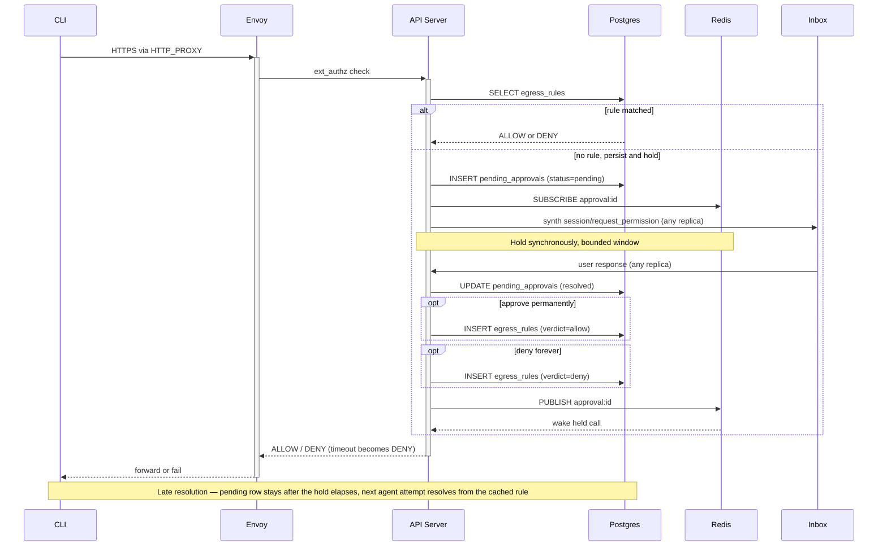
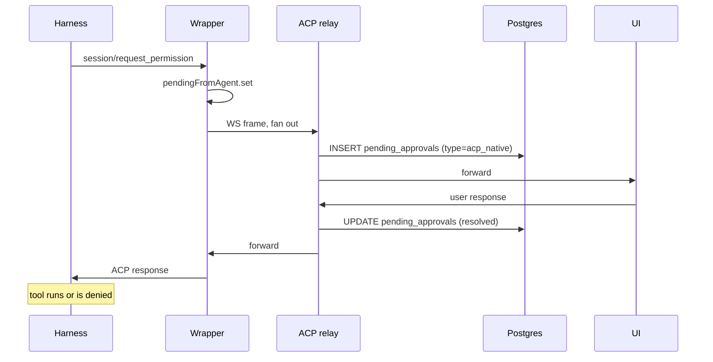

# DRAFT: Unified HITL UX — verdict authority outside the agent pod

**Date:** 2026-04-27
**Status:** Proposed
**Owner:** @jezekra1

## Context

[`DRAFT-envoy-credential-gateway`](DRAFT-envoy-credential-gateway.md) introduces an Envoy `ext_authz` HITL gate for credential-injected egress. Independently, the platform supports ACP-native permission requests for the harness's own tool calls, parked in the wrapper's `pendingFromAgent` and resolved by the engaged ACP client ([acp-runtime.ts:580](../../packages/agent-runtime/src/modules/acp/services/acp-runtime.ts#L580)).

The two gates protect different things — ACP gates guard the *harness's tool execution*; ext_authz guards *credential injection on outbound HTTP* — and neither layer has the data to pre-empt the other. Both stay. If both ship with their own user surface, the user gets two parallel approval systems for the same shape of decision. That's the user-visible problem this ADR addresses.

A second constraint: the API Server is horizontally scalable ([ADR-007](007-acp-relay.md)). HITL coordinator state pinned to a specific replica — long-lived blocking promises across user think-time — would compound the relay-bottleneck problem. Whatever this ADR commits to has to work with multiple stateless replicas behind a load balancer.

<details>
<summary><strong>Threat model: the wrapper cannot be the verdict authority for ext_authz</strong></summary>

The wrapper runs inside the agent pod. It shares a network namespace with the agent container, so anything bound on the wrapper's localhost is reachable from the agent. The agent runs arbitrary, model-driven code — the platform's whole threat model assumes it is compromisable on every request.

If `pendingFromAgent` were the source of truth for ext_authz verdicts, an attacker (a compromised harness, or a vulnerability in the wrapper's JSON-RPC parser exploited by the agent) could:

- Open a WS to the wrapper's ACP endpoint posing as a UI client and inject a synthetic `RequestPermissionResponse` for the matching JSON-RPC ID.
- Cause the wrapper's `handleClientMessage` ([acp-runtime.ts:716](../../packages/agent-runtime/src/modules/acp/services/acp-runtime.ts#L716)) to record the entry as `resolved/approved`.
- Have the next ext_authz call hit that "approved" verdict and let the credential-injected request through.

The credential gate is a security boundary *outside* the agent's blast radius. That property breaks if the verdict authority lives in the same pod.

ACP-native permissions are different. They guard the *harness's own tool calls*; an attacker who can compromise the wrapper can also patch `canUseTool` directly to skip permission checks. ACP-native HITL is therefore a UX feature, not a security boundary against the agent. Wrapper-local resolution is appropriate there.

</details>

<details>
<summary><strong>Why ACP-native cannot have an asynchronous inbox</strong></summary>

The harness's `canUseTool` callback is invoked synchronously inside the SDK's turn loop while processing a `session/prompt`. The `await this.client.requestPermission(...)` is a JavaScript Promise tied to the harness process's event loop — it cannot be persisted, serialized, or revived by another process. If the harness/pod dies, the entire promise chain vaporizes with it.

ACP `session/resume` ([types.gen.d.ts:2492-2524](../../node_modules/.pnpm/@agentclientprotocol+sdk@0.17.1_zod@4.3.6/node_modules/@agentclientprotocol/sdk/dist/schema/types.gen.d.ts#L2492-L2524)) is marked **UNSTABLE** and explicitly does *not* deliver pending tool-call verdicts; it returns `configOptions / models / modes` only. There is no protocol entry point that says "here's the answer to a permission you asked for in a now-dead turn."

Five candidate workarounds (replay request, synthesize fresh `requestPermission`, fork the SDK to add canUseTool checkpointing, fingerprint-based pre-approval, long-poll across hibernation) all fail for one of two reasons: no harness-side `await` to deliver the response to, or duplicating the harness's own `allow_always` / `addRules` durable-decision system. ACP-native is therefore live-only by protocol design.

</details>

<details>
<summary><strong>Today's reality, made explicit</strong></summary>

Permission prompts only surface to a user when there is a live UI ACP relay attached. Slack, Telegram, scheduled triggers, and harness-API-server probes all drive the agent through [`acp-client.ts`](../../packages/api-server/src/core/acp-client.ts), whose `requestPermission` handler at [acp-client.ts:72-73](../../packages/api-server/src/core/acp-client.ts#L72-L73) auto-selects the first option.

Today's contract: live UI → user answers prompts; everything else → permissions bypassed entirely. This ADR formalizes that for ACP-native and adds a security-grounded ext_authz path alongside.

</details>

## Decision

**ext_authz HITL approvals are emitted as ACP `session/request_permission` frames so the user-visible primitive is exactly one. The verdict authority for ext_authz lives in the API Server backed by Postgres — outside the agent pod's trust boundary. ACP-native permissions stay wrapper-local for resolution because they are not a security boundary against the agent process. A single global inbox surfaces all pending approvals across the user's agents.**

### Two-layer architecture, split by trust model

| Gate | Verdict authority | Storage | Why |
|---|---|---|---|
| **ACP-native** (harness asks to run tool) | Wrapper-local | In-memory `pendingFromAgent` (mirrored to DB for inbox visibility) | Harness is in-pod; permission is a UX feature, not a security boundary. Wrapper resolution does not change the agent's effective capability. |
| **ext_authz** (egress credential injection) | API Server | Postgres (`egress_rules` + `pending_approvals`) | Security boundary; verdict authority must be out-of-pod so a compromised wrapper/agent cannot forge approvals. |

UI surface is unified: both kinds appear as `session/request_permission` to UI / Slack / future channels, rendered by the same component. Mechanics underneath differ; the user does not see the difference.

### Storage — Postgres, two new tables

Postgres is already a hard platform dependency ([ADR-017](017-db-backed-sessions.md)). We extend it with:

- **`egress_rules`** — per-agent allow/deny rules. Looked up by ext_authz on every call before any user prompt.
  ```
  agent_id, host, method, path_pattern, verdict (allow|deny),
  decided_by, decided_at, status (active|revoked)
  ```
  v1 stores permanent rules. Time-bounded rules ("approve for an hour") add a `valid_until` column in v1.5; out of scope here.

- **`pending_approvals`** — durable record of every request that needs a user decision. Written instantly when a request enters the system (before any synth-frame delivery), so the inbox sees it from t=0.
  ```
  id, type (ext_authz|acp_native), session_id, agent_id, owner_sub,
  payload (host/method/path | tool name + args), created_at,
  expires_at, resolved_at, verdict, decided_by
  ```

**Postgres is the source of truth for everything durable** — rules, pending rows, verdicts, audit. The inbox query is `SELECT … FROM pending_approvals WHERE owner = ? AND status = 'pending'`; surviving offline / refresh / replica restart is a property of the row existing in Postgres.

**Redis pub/sub** ([`DRAFT-redis-platform-primitive`](DRAFT-redis-platform-primitive.md)) carries the *ephemeral* wake-up signal for held ext_authz calls (channel-per-pending-id, `approval:<id>`). It is on the signal path, never the truth path: a Redis outage degrades held calls to one extra agent retry — no data loss, no incorrect verdicts. Postgres-poll at ~250ms is the Redis-down fallback.

### ext_authz mechanics — out-of-pod authority, synchronous hold

The egress request is initiated by **whatever the agent decided to run** — `gh`, `curl`, `npx some-cli`, a Python SDK. None of those tools understand HITL retry semantics; a `202 + Retry-After` would be treated as an upstream error. So ext_authz holds the call synchronously for a bounded window long enough for a live consumer to respond, while the durable DB row makes any later resolution apply on the agent's next attempt.



The synchronous hold is **a UX optimization, not a security property**. Its only job is to avoid an extra agent-retry roundtrip in the live-user case. A failed mid-hold call (replica restart, hibernation, Envoy timeout) is a normal upstream error to the CLI; the durable pending row is unaffected, and the next agent attempt resolves from it.

### Timeouts

The hold ends for several distinct reasons; the durable pending row is unaffected by all of them.

| Cause | Behavior |
|---|---|
| Envoy ext_authz / CLI HTTP timeout | Hold wakes from cancel; API replies DENY to Envoy. Pending row stays open. |
| Agent pod hibernates | Held TCP closes; same as above. |
| Harness crashed (not platform-detectable) | Fixed `expires_at` on the pending row (default ~10 min); background sweeper marks expired. |
| User takes too long to act | Same — `expires_at` fires; row marked expired. |
| Approve / deny / no-action verdict | Row resolved; verdict applies to current and future calls (rule path). |

Approve-temporarily (time-bounded rule) is **out of scope for v1**; the schema (`valid_until` on `egress_rules`) accommodates it.

### Inbox — single point of resolution

The inbox is the global view of `pending_approvals` for the user, on the main UI page. The same row is also surfaced inline in the session UI when the user is in the agent's session. Both surfaces write through the same DB row; first verdict wins; Redis pub/sub closes the loop on every replica holding any of the user's WSs.

| Item type | Available actions |
|---|---|
| **ext_authz** | Approve permanently (writes `egress_rules` allow) · Deny forever (writes `egress_rules` deny) · No action (let `expires_at` fire) |
| **ACP-native** | If active: approve / deny — verdict goes through the wrapper's `pendingFromAgent` resolution path (today's mechanics). If inactive (wrapper restarted, harness moved on): no action available — item shown as expired. |

"Active" for ACP-native is determined by the wrapper writing a heartbeat into `pending_approvals.last_seen_at`; the API Server flips items to inactive when the heartbeat lags beyond a fixed window.

### ACP-native mechanics — wrapper-local, mirrored to DB

Harness emits `requestPermission` over its ACP channel. Wrapper places it in `pendingFromAgent` and fans out to engaged ACP clients via the existing engage-replay mechanism. The API Server's ACP relay observes the frame in transit and **mirrors it into `pending_approvals` (type=acp_native)** so the inbox can show it. User responds; wrapper's `handleClientMessage` matches by ID, removes from `pendingFromAgent`, forwards to harness via `agent.send`. Harness's awaiting Promise resolves. The relay observes the response and updates the DB row to resolved.



Pod death takes the in-flight turn with it; the in-memory Promise vaporizes; the DB row is marked inactive on the next sweeper pass; the harness's `addRules` config (durable across pod restarts via session log) handles "remember this decision" if the user wants that.

### Multi-replica coordination

API Server replicas are stateless; Postgres is the only shared substrate.

- **Verdict notification to held call.** Replica A is holding an ext_authz call, `SUBSCRIBE`d to `approval:<id>`. Replica B receives the user's response, writes the verdict to Postgres, and `PUBLISH approval:<id>`. A wakes and reads the verdict from Postgres. Postgres-poll at ~250ms during the hold window covers Redis-down scenarios.
- **Synth prompt delivery.** Replica A creates a pending row and `PUBLISH user:<sub>:pending`; replica B holds the user's WS, subscribed to that channel for the connected user, and injects synth frames into the relay stream. If no replica holds the user's WS, the inbox row + Slack push delivery cover the offline case.
- **Replica restart mid-hold.** In-flight ext_authz call fails; pending row unaffected; subsequent retries hit the DB and resolve normally.

## Scope — what this ADR explicitly does *not* do

- **No async inbox for ACP-native** beyond the live-active case. ACP protocol semantics block it; documented as a clean boundary.
- **No time-bounded ext_authz approvals (v1).** Schema accommodates `valid_until`; UI/policy is v1.5.
- **No interactive Slack/Telegram by default.** `auto-approve` ([acp-client.ts:72-73](../../packages/api-server/src/core/acp-client.ts#L72-L73)) stays the default; `interactive` is opt-in.
- **No checkpoint/resume of in-flight turns.** ACP-native permissions die with their turn.
- **No cross-agent rule sharing.** Each agent has its own `egress_rules`. Cross-agent reuse (e.g. shared at the owner level) is a v1.5 question.

## Alternatives Considered

<details>
<summary>Wrapper-as-verdict-authority for ext_authz</summary>

Rejected on security grounds — see threat model. Wrapper is co-located with the untrusted agent; verdict authority must live outside the agent pod's blast radius.

</details>

<details>
<summary>Two parallel approval UIs (one per gate)</summary>

Rejected — same user faces same shape of decision through two different surfaces; doubles up notification, rendering, replay, history work.

</details>

<details>
<summary>Return <code>202 + Retry-After</code> to Envoy and rely on agent retry</summary>

Rejected — the originator is whatever the agent decided to run (`gh`, `curl`, `npx some-cli`, language SDKs); arbitrary CLIs do not honor HITL retry semantics. Synchronous hold for a bounded window is the only shape that works without per-tool retry coordination.

</details>

<details>
<summary>Indefinite hold across human think-time (hours / overnight)</summary>

Rejected — pins replica activity to human availability, fails on replica restart in a way that loses the user's eventual response, exceeds every reasonable client-side and middlebox timeout. Bounded hold + durable pending row + late-rule-applies pattern covers overnight-scale approvals correctly.

</details>

<details>
<summary>Per-request fingerprint-keyed pre-approval (instead of per-agent rules)</summary>

Considered briefly. Rejected for v1 — the agent is unlikely to re-issue a byte-identical request, so fingerprint-keyed approvals would prompt repeatedly for what the user perceives as "the same operation." Rules keyed on `(host, method, path-prefix)` model user intent ("I trust this agent to call api.github.com") much better than per-byte fingerprints.

</details>

<details>
<summary>Forking Claude Code SDK for canUseTool checkpoint/resume</summary>

Would technically enable ACP-native async inbox. Rejected — harness-specific, multiplies per harness, permanent fork burden. Harness's existing `allow_always` / `addRules` covers the actual use case.

</details>

<details>
<summary>Postgres <code>LISTEN/NOTIFY</code> as the wake-up channel (instead of Redis)</summary>

Considered. Rejected at the platform level by [`DRAFT-redis-platform-primitive`](DRAFT-redis-platform-primitive.md), which establishes Redis as the cross-replica signaling primitive going forward. Postgres-poll remains the Redis-down fallback; pg LISTEN/NOTIFY adds nothing over it.

</details>

## Consequences

- **One approval primitive in the UI**, one rendering component, one inbox.
- **API Server is stateless for HITL.** All HITL state is in Postgres. HPA-friendly, restart-tolerant.
- **Verdict authority for ext_authz lives outside the agent pod.** A compromised wrapper or agent cannot forge approvals.
- **Permanent egress rules** mean the cron / scheduled-trigger case works end-to-end after a single one-time approval: first run fails closed, inbox notification fires, user approves, all future runs go through.
- **Inbox is genuinely offline-friendly.** Pending row exists from t=0; Slack/email push delivery works without the user holding a WS.
- **ACP-native HITL stays wrapper-local.** No security degradation, no behavior change vs today; gains visibility in the global inbox via the relay's mirror write.
- **API Server additions.** ext_authz HITL handler, two new Postgres tables, synth-frame injection in the ACP relay, ACP-native mirror write/update in the relay, Redis pub/sub for cross-replica wake-ups (Postgres-poll fallback). All stateless code.
- **Wrapper additions are minimal.** Heartbeat write so the inbox can detect inactive ACP-native items. No verdict logic changes.
- **Frontend renders an additional permission kind + the inbox view.** ACP `RequestPermissionRequest.toolCall` accommodates ext_authz items; new description template per kind, same component.
- **Pod restart / hibernation:** ACP-native pending dies with the turn (today's behavior, marked inactive in DB); ext_authz pending survives in DB and is resolved on agent retry from any future pod incarnation.

## Related ADRs

- [`DRAFT-envoy-credential-gateway`](DRAFT-envoy-credential-gateway.md) — establishes the ext_authz HITL gate this ADR resolves. The `egress_rules` table here is the v1 implementation of that ADR's "stored decision" concept, reshaped from per-request fingerprint to per-agent rule.
- [ADR-007 — ACP traffic always proxied through the API Server](007-acp-relay.md) — the relay this ADR extends with synth-frame injection and ACP-native mirror writes.
- [ADR-017 — DB-backed sessions](017-db-backed-sessions.md) — the platform Postgres this ADR extends with `egress_rules` and `pending_approvals`.
- [ADR-018 — Slack integration](018-slack-integration.md) — first-class HITL consumer in `interactive` mode.
- [ADR-027 — Slack per-turn user impersonation](027-slack-user-impersonation.md) — fork-Job pods inherit this same ext_authz authority shape (the parent instance's API Server is the authority; fork-Job pods don't change the trust model).
- [`DRAFT-redis-platform-primitive`](DRAFT-redis-platform-primitive.md) — establishes Redis as the platform's pub/sub / queue / cache primitive. Cross-replica wake-ups in this ADR are the first consumer.
