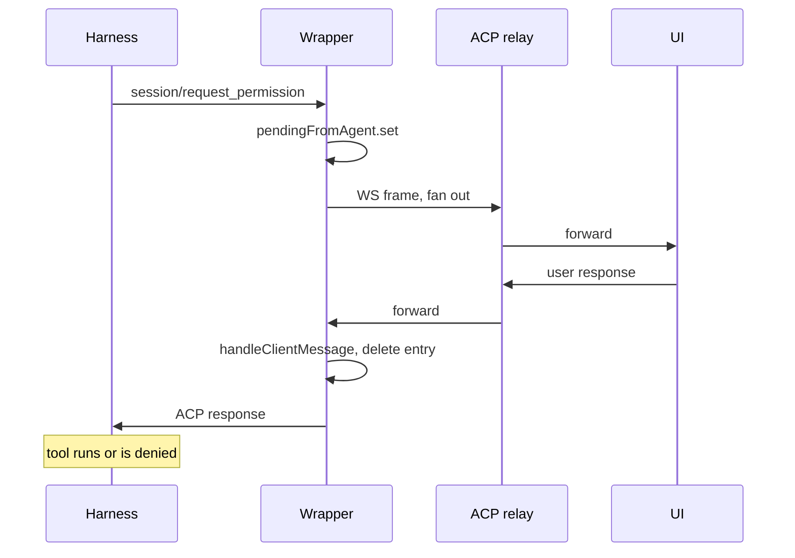
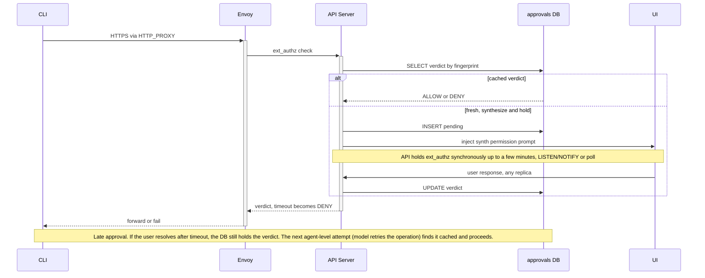

# DRAFT: Unified HITL UX — verdict authority outside the agent pod

**Date:** 2026-04-27
**Status:** Proposed
**Owner:** @jezekra1

## Context

[`DRAFT-envoy-credential-gateway`](DRAFT-envoy-credential-gateway.md) introduces an Envoy `ext_authz` HITL gate for credential-injected egress, with stored-decision-retry durability. Independently, the platform supports ACP-native permission requests: the harness emits `session/request_permission`, the wrapper at [`agent-runtime`](../../packages/agent-runtime/src/modules/acp/services/acp-runtime.ts) parks them in `pendingFromAgent`, fans out to engaged ACP clients ([acp-runtime.ts:580](../../packages/agent-runtime/src/modules/acp/services/acp-runtime.ts#L580)), and resolves on response.

The two gates protect different things: ACP gates guard the *harness's own tool execution*; ext_authz guards *credential injection on outbound HTTP*. They are not substitutable — neither layer has the data the other needs to pre-empt it. Both gates remain.

If both ship with their own user surface, the user gets two parallel approval systems: one ACP permission dialog from the harness, one ext_authz-driven egress prompt. Same user, same shape of decision, two unrelated UI components and two notification channels. That's the user-visible problem this ADR addresses.

A second constraint sits underneath: the API Server must be horizontally scalable. [ADR-007](007-acp-relay.md) names it a per-connection relay bottleneck for ACP traffic. Adding HITL coordinator state pinned to a specific replica — long-lived blocking promises across user think-time — would compound the problem. Whatever this ADR commits to has to work with multiple stateless replicas behind a load balancer.

### Threat model: the wrapper cannot be the verdict authority for ext_authz

The wrapper runs inside the agent pod. It shares a network namespace with the agent container, so anything bound on the wrapper's localhost (its ACP HTTP/WS endpoints, any auxiliary internal endpoints) is reachable from the agent. The agent runs arbitrary, model-driven code — the platform's whole threat model assumes it is compromisable on every request.

If `pendingFromAgent` were the source of truth for ext_authz verdicts, an attacker (a compromised harness, or a vulnerability in the wrapper's JSON-RPC parser exploited by the agent) could:

- Open a WS to the wrapper's ACP endpoint posing as a UI client and inject a synthetic `RequestPermissionResponse` for the matching JSON-RPC ID.
- Cause the wrapper's `handleClientMessage` ([acp-runtime.ts:716](../../packages/agent-runtime/src/modules/acp/services/acp-runtime.ts#L716)) to record the entry as `resolved/approved`.
- Have the next ext_authz call hit that "approved" verdict and let the credential-injected request through.

The credential gate is supposed to be a security boundary *outside* the agent's blast radius. That property is broken if the verdict authority lives in the same pod.

**Envoy must consult an authority that is not in the agent pod.** That authority is the API Server backed by a durable store. The wrapper is fine for *displaying* a prompt as part of unified UX, but the **verdict-authority path must bypass the wrapper entirely** for ext_authz.

ACP-native permissions are different. They guard the *harness's own tool calls*. The harness is the agent process; an attacker who can compromise the wrapper can also patch `canUseTool` directly to skip permission checks entirely. ACP-native HITL is therefore a UX feature, not a security boundary against the agent. Wrapper-local resolution is appropriate there.

### Why ACP-native cannot have an asynchronous inbox

For ext_authz, an inbox is technically feasible — the durable store gives us pending entries that survive the user being offline; a `GET /approvals` REST surface can render them; user can approve from any device, any time. It's an additive scope decision, not a fundamental limitation.

For **ACP-native**, an asynchronous inbox is blocked by the ACP protocol's tool-call lifecycle. Concretely:

The harness's `canUseTool` callback ([acp-agent.js:678-801](../../node_modules/.pnpm/@agentclientprotocol+claude-agent-acp@0.24.2/node_modules/@agentclientprotocol/claude-agent-acp/dist/acp-agent.js#L678-L801)) is invoked synchronously inside the SDK's turn loop while processing a `session/prompt`:

```
ACP session/prompt (turn)
  └─ Claude Code SDK turn loop
       └─ model emits tool_use
            └─ SDK invokes canUseTool callback
                 └─ await this.client.requestPermission(...)   ← in-process Promise
```

The `await` is a JavaScript Promise tied to the harness process's event loop. **It cannot be persisted, serialized, or revived by another process.** If the harness/pod dies (orphan TTL, hibernation, restart), the entire promise chain — the rest of `canUseTool`, the SDK turn loop, the tool execution — vaporizes with it.

ACP `session/resume` does *not* close this gap. Per the protocol type at [types.gen.d.ts:2492-2524](../../node_modules/.pnpm/@agentclientprotocol+sdk@0.17.1_zod@4.3.6/node_modules/@agentclientprotocol/sdk/dist/schema/types.gen.d.ts#L2492-L2524), resume is marked **UNSTABLE** and explicitly narrow:

> Resumes an existing session **without returning previous messages**. This is useful for agents that can resume sessions but don't implement full session loading.

It returns `configOptions / models / modes` state. There is no field to deliver a pending tool-call verdict, no cursor for partial-turn resumption, no entry point that says "here's the answer to a permission you asked for in a now-dead turn." Claude Code's `unstable_resumeSession` ([acp-agent.js:180-187](../../node_modules/.pnpm/@agentclientprotocol+claude-agent-acp@0.24.2/node_modules/@agentclientprotocol/claude-agent-acp/dist/acp-agent.js#L180-L187)) just calls `getOrCreateSession({ resume: sessionId, ... })` — a fresh Session object pointing at the same Claude Code SDK session ID, ready for new prompts.

**Workarounds and why they are wrong or too expensive:**

1. **Persist the request frame and replay it on wake.** The wrapper writes the pending `RequestPermissionRequest` JSON to disk; on wake, replay it. *Doesn't work end-to-end.* Replaying the request to the UI gets the user's verdict, but the inbound side has no consumer — the original `await` is gone, and the new harness process has not invoked `canUseTool` for that tool call. The verdict has nowhere to land.

2. **Have the wrapper synthesize a fresh `requestPermission` after wake.** Same dead-end. The wrapper synthesizes outbound but there is still no harness-side `await` to deliver the response to.

3. **Wrapper-side checkpoint/resume of the SDK's turn loop.** Persist enough harness state that the SDK can be re-driven from the `canUseTool` suspension point — model output up to the tool call, conversation context, tool execution state. *Architecturally wrong.* Claude Code SDK's turn loop is in-memory and does not expose a resume-from-tool-use entry point; it persists only completed turn state via [`loadSession`](../../node_modules/.pnpm/@agentclientprotocol+claude-agent-acp@0.24.2/node_modules/@agentclientprotocol/claude-agent-acp/dist/acp-agent.js#L188). Adding mid-turn checkpointing would mean either (a) forking the SDK to add a checkpoint API at the canUseTool boundary, or (b) intercepting enough of the SDK's protocol to drive turn execution from the wrapper. Either way: harness-specific (Claude Code only — Codex and Gemini have their own turn machinery, multiplying the effort), large investment, ongoing fork cost. The wrong layer to invest at.

4. **Fingerprint-based pre-approval — store the verdict, auto-resolve next time the model asks for the same tool.** Architecturally duplicates the harness's own permission model: Claude Code already supports `allow_always` and session `addRules` ([acp-agent.js:776-787](../../node_modules/.pnpm/@agentclientprotocol+claude-agent-acp@0.24.2/node_modules/@agentclientprotocol/claude-agent-acp/dist/acp-agent.js#L776-L787)) for "remember this decision." Adding a parallel store-side memory creates two competing sources of "have I already approved this?" with subtle disagreement modes, and we would still depend on the model re-issuing the same fingerprint on the next attempt — a probabilistic property of model behavior, not a protocol guarantee.

5. **Long-poll the user's response across pod hibernation.** Cannot — the JS Promise is in-process. Cannot survive any process boundary, let alone a pod restart.

The honest conclusion: an asynchronous inbox for ACP-native permissions requires either forking the SDK to make tool-call execution suspendable (option 3) or duplicating the harness's permission model in our store (option 4). Both are architecturally wrong for this platform; the harness's own permission system is the correct place to handle "remember decisions across runs." ACP-native HITL is therefore live-only by protocol design.

### Today's reality, made explicit

The platform's existing behavior already reflects this constraint. Permission prompts only surface to a user when there is a live UI ACP relay attached. Every other path — Slack, Telegram, scheduled triggers, harness-API-server probes — drives the agent through [`acp-client.ts`](../../packages/api-server/src/core/acp-client.ts), whose `requestPermission` handler at [acp-client.ts:72-73](../../packages/api-server/src/core/acp-client.ts#L72-L73) auto-selects the first option (`allow_always` for the standard set):

```ts
async requestPermission(params: any) {
  return { outcome: { outcome: "selected" as const, optionId: params.options[0].optionId } };
},
```

So today's contract is: live UI → user answers prompts; everything else → permissions bypassed entirely. This ADR formalizes that for ACP-native and adds a security-grounded ext_authz path alongside.

## Decision

**ext_authz HITL approvals are emitted as ACP `session/request_permission` frames so the user-visible primitive is exactly one. The verdict authority for ext_authz lives in the API Server backed by a durable store — outside the agent pod's trust boundary. The wrapper is not in the trust chain for ext_authz. ACP-native permissions stay wrapper-local for resolution because they are not a security boundary against the agent process.**

### Two-layer architecture, split by trust model

| Gate | Verdict authority | Storage | Why |
|---|---|---|---|
| **ACP-native** (harness asks to run tool) | Wrapper-local | In-memory `pendingFromAgent` | Harness is in-pod; permission is a UX feature, not a security boundary. Resolution by the wrapper does not change the agent's effective capability. |
| **ext_authz** (egress credential injection) | API Server | DB-backed approval store | Security boundary; verdict authority must be out-of-pod so a compromised wrapper/agent cannot forge approvals. |

UI surface is unified: both kinds appear as `session/request_permission` to UI / Slack / future channels, rendered by the same component. Mechanics underneath differ; the user does not see the difference.

### ext_authz mechanics — out-of-pod authority, synchronous hold

The egress request that triggers an ext_authz call is initiated by **whatever the agent decided to run** — `gh`, `curl`, `npx some-cli`, a Python SDK, etc. None of those tools understand HITL retry semantics; a `202 + Retry-After` would be treated as an upstream API failure and the CLI would exit with an error, not retry. The wrapper cannot retry on behalf of an opaque CLI either. So ext_authz holds the request **synchronously** for a short window, just long enough for a live consumer to respond:

```
Envoy ext_authz call from agent egress (originator: arbitrary CLI —
gh / curl / npx / language SDK — no HITL retry semantics)
  │
  ▼
API Server (any replica) — stateless handler
  │
  ├─ SELECT from approvals WHERE fingerprint = F
  │
  ├─ resolved (ALLOW / DENY) → return immediately to Envoy. Done.
  └─ pending or no entry →
        ├─ if no entry:
        │     ├─ INSERT pending (approvalId, instance, sessionId,
        │     │                  fingerprint, payload)
        │     └─ Inject synth session/request_permission into the user's
        │        ACP relay stream toward UI (any replica holding the
        │        user's WS) AND/OR push via Slack adapter AND/OR future
        │        channels. Synth ID is in a namespace the wrapper does
        │        not own.
        ├─ HOLD the ext_authz call synchronously, up to a configured
        │  window (default on the order of a few minutes — long enough
        │  for a Slack/UI roundtrip including the user switching apps).
        │  Subscribe via LISTEN/NOTIFY (or poll the DB) for the verdict
        │  landing — see Multi-replica below. Upper bound is whichever
        │  client-side timeout fires first: Envoy's ext_authz timeout
        │  (configurable), the originating CLI's HTTP read timeout
        │  (varies, often unbounded for response read), or any TCP idle
        │  timeout on the path.
        ├─ verdict arrives in time → return ALLOW / DENY to Envoy.
        └─ window elapses → return DENY to Envoy. The DB entry stays in
                            place; if the user resolves it later, the next
                            time the *agent* (model-layer, not CLI) attempts
                            the same operation, ext_authz finds the cached
                            verdict and allows the request immediately.
```

The synth `session/request_permission` is **injected by the API Server's ACP relay into the downstream traffic**, not by the wrapper. The wrapper never sees it. When the user's response comes back upstream, the relay matches the synth ID, **intercepts the response, writes verdict to the DB, and does NOT forward to the wrapper**. The wrapper is bypassed end-to-end for ext_authz.

The hold introduces bounded replica activity — a few minutes per held call, not the unbounded human-decision durations a fully-async inbox would imply. A replica restart mid-hold fails that one in-flight ext_authz call (the CLI sees a normal upstream error); the durable DB entry is unaffected and any subsequent agent-level attempt resolves from it. The hold is tuned for the realistic "Slack DM → user switches apps → reads → clicks" UX latency budget; it is not a substitute for an offline approval inbox. If the user takes longer than the window allows, we fall through to "DB stays pending, model retries the operation later, late verdict applies on retry." That's the only stable shape given the originator's lack of HITL awareness.

### ACP-native mechanics — wrapper-local (today's behavior, unchanged)

Harness emits `requestPermission` over its ACP channel. Wrapper places it in `pendingFromAgent`, fans out to engaged ACP clients via the existing engage-replay mechanism. User responds; wrapper's `handleClientMessage` matches by ID, removes from `pendingFromAgent`, forwards to harness via `agent.send`. Harness's awaiting Promise resolves; tool runs (or doesn't). No new code, no DB writes.

Pod death takes the in-flight turn with it; the Promise vaporizes; the harness's `addRules` config (durable across pod restarts via session log) handles "remember this decision" if the user wants that. There is no async inbox for this kind by ACP protocol design (see Context).

### Live consumers — Slack and Telegram as first-class HITL participants

Each delivery channel is an ACP client connected through the API Server. Today's [`acp-client.ts`](../../packages/api-server/src/core/acp-client.ts) auto-approve becomes one of two modes:

- `auto-approve` (today's default) — preserves existing behavior. Adapters that drive the agent through `createAcpClient` continue to bypass permissions. Zero behavioral regression.
- `interactive` — adapter receives `requestPermission` (whether harness-originated or API-Server-synth), surfaces it as a Slack DM with `[Approve] [Deny]` buttons, returns the user's response as the ACP response. The Slack adapter is itself a server-side process; the user clicking a button is a roundtrip *through* an already-live channel.

Whichever consumer responds first wins; late responses from other consumers are silently dropped (existing wrapper behavior at [acp-runtime.ts:727-728](../../packages/agent-runtime/src/modules/acp/services/acp-runtime.ts#L727-L728); identical pattern for synth IDs intercepted at the API Server).

### Multi-replica coordination

API Server replicas are stateless. The DB is the only shared substrate. Two coordination needs arise:

- **Verdict notification to the held call.** Replica A is holding an ext_authz call, blocked on the verdict. Replica B receives the user's response (e.g., user is connected to a different replica's WS, or clicked a Slack button). B writes the verdict to the DB. A needs to wake up. Mechanism: postgres `LISTEN/NOTIFY` keyed by `approvalId` is the obvious fit — A `LISTEN approval:<id>`, B writes verdict and `NOTIFY approval:<id>`. Fallback for environments without LISTEN/NOTIFY: A polls the DB every ~250ms during the hold window. Implementation detail; this ADR doesn't mandate.
- **Synth prompt delivery to the right user WS.** Replica A creates a pending entry while holding ext_authz; replica B is holding the user's ACP relay. The synth frame needs to land on B's WS. Same pattern: B subscribes for new pending entries scoped to its connected users (LISTEN/NOTIFY or poll-on-engage) and injects synth frames into the relay stream when notified. If no replica is currently holding the user's WS, the prompt isn't delivered live — it sits in the DB and is delivered on next engage (or via Slack adapter, which is itself a server-side process that doesn't need the user's WS).

Replica restart mid-hold: the in-flight ext_authz call fails (Envoy gets a connection error → upstream-error to CLI). The DB entry is unaffected. Subsequent agent-level retries hit the same DB and resolve normally.

### Flow

The two gates are best read as separate sequences because the participants and trust boundaries differ.

**ACP-native** — wrapper-local, today's behavior. The wrapper runs inside the agent pod; the relay is in the API Server.



**ext_authz** — API Server is the verdict authority; wrapper bypassed end-to-end. CLI is whatever the agent invoked: `gh`, `curl`, `npx`, language SDK, etc.



The "correct producer" question has clean answers per gate:

- **ACP-native:** producer is co-located with the wrapper; in-pod resolution is fine because the gate is not a security boundary against the agent.
- **ext_authz:** producer is whichever ext_authz call happens next (the held one if the user is fast, a future model-driven attempt if not), served by any replica reading the same DB. Wrapper is bypassed.

### Scope — what this ADR explicitly does *not* do

- **No asynchronous inbox for ACP-native permissions.** Blocked by ACP protocol semantics (see Context). Workarounds rejected as fork-the-SDK or duplicate-the-harness.
- **No asynchronous inbox UI for ext_authz in this ADR.** The durable store enables one — `GET /approvals?status=pending` is straightforward — but the inbox UI is a separate scope. Slack/email push delivery against the same store is the offline-friendly path commitment.
- **No fingerprint-based pre-approval for ACP-native.** The harness's own `allow_always` / `addRules` is the correct place for "remember this decision."
- **No interactive Slack/Telegram by default.** `auto-approve` stays the default; `interactive` is opt-in. Existing flows unchanged.
- **No checkpoint/resume of in-flight turns.** ACP-native permissions die with their turn. Recovery is the harness's permission model on the next user prompt, not a platform-level "I'll get to it later" pile.

## Alternatives Considered

**Wrapper-as-verdict-authority for ext_authz.** ext_authz queries `pendingFromAgent` for verdicts; wrapper resolves entries via its existing handleClientMessage path. **Rejected on security grounds.** The wrapper is co-located with the untrusted agent. A compromised wrapper (parser bug, agent-side WS injection over the shared network namespace) can forge "approved" verdicts, bypassing the credential gate. The whole point of ext_authz is to enforce a check outside the agent's blast radius; that property breaks if the verdict source is in the pod.

**Two parallel approval UIs.** Default trajectory if the credential-gateway ADR ships without UX unification. Rejected — same user faces same shape of decision through two different surfaces; doubles up notification, rendering, replay, history work.

**Return `202 + Retry-After` to Envoy and rely on CLI / agent retry.** The most natural-looking shape if you assume retry-aware clients. Rejected — the originator of the egress is *whatever the agent decided to run* (`gh`, `curl`, `npx some-cli`, language SDKs), and arbitrary CLIs do not honor HITL retry semantics. A `gh` that gets back a 202 exits with an error code, not retry. The wrapper can't retry on the CLI's behalf either — it doesn't even know what kind of HTTP call the CLI was making. Synchronous hold for a short window is the only shape that works without per-tool retry coordination.

**API Server holds the ext_authz call indefinitely across human think-time (hours / overnight).** Long-poll across arbitrary user availability. Rejected — pins a replica per pending decision indefinitely, fails on replica restart in a way that loses the user's eventual response, conflicts with the stateless API Server posture, and exceeds every reasonable client-side and middlebox timeout. The chosen *bounded* synchronous hold (a few minutes — long enough for a realistic Slack/UI roundtrip but not for "approve overnight") is materially different: replica activity is bounded, a failed mid-hold call surfaces as a normal upstream error, the DB is unaffected, and overnight-scale approvals fall through to the model-retries-later path rather than pretending the platform supports indefinite holds.

**Forking Claude Code SDK to add canUseTool checkpoint/resume.** Would technically enable ACP-native async inbox. Rejected as architecturally wrong: harness-specific (multiplies per harness — Claude Code, Codex, Gemini), permanent fork maintenance burden, the SDK's turn loop wasn't designed for mid-turn suspension. The harness's existing permission model already covers the actual use case (long-lived approvals via `allow_always`).

**Fingerprint-based pre-approval shared store across both kinds.** Mirror both into one durable store; auto-resolve future requests by fingerprint. Rejected — duplicates the harness's permission model for ACP-native (two competing "have I approved this?" memories with subtle disagreement modes), depends on probabilistic model behavior to re-issue the same fingerprint, and re-introduces complexity the security model does not require for ACP-native (which is not a security boundary).

**Wrapper proxies the HTTPS call back to the CLI on the agent's behalf, holding indefinitely until verdict.** Make the wrapper an HTTP-aware retry layer that buffers the outbound request and waits. Rejected — the wrapper has no general way to know how to retry an arbitrary CLI's HTTP call (idempotency, body re-serialization, custom headers, streaming bodies, content negotiation), and even if it could, the originating CLI process still sees its own HTTPS call hanging for whatever duration. We'd be papering over the retry-semantics gap with a layer that has to know each tool's retry behavior. The synchronous-hold-then-fail shape composes with whatever the model decides to do next without the platform pretending to be a retry proxy.

## Consequences

- **One approval primitive in the UI**, one rendering component. ACP `session/request_permission` is what the user sees, regardless of which gate fired.
- **API Server is stateless for HITL.** ext_authz calls are stateless DB queries. Verdict writes are stateless DB writes. No replica-affine in-memory promises. HPA-friendly, restart-tolerant.
- **Verdict authority for ext_authz is outside the agent pod.** A compromised wrapper or agent cannot forge approvals because the verdict-authoritative path bypasses the wrapper entirely.
- **ACP-native HITL stays wrapper-local.** No security degradation (it isn't a security boundary against the agent), no behavior change vs today.
- **Slack / Telegram / future channels** become first-class HITL consumers in `interactive` mode; `auto-approve` (today's default) unchanged. Net new capability, zero regression.
- **Async inbox is feasible for ext_authz** (durable store enables it); explicitly out of scope here. Slack/email push delivery is the supported offline path. Inbox UI is a follow-on if real demand emerges.
- **Async inbox is fundamentally not feasible for ACP-native.** ACP protocol limitation; documented as a clean boundary so future asks are answered with "by protocol design, not platform choice."
- **Wrapper additions are minimal.** No new endpoints, no DB access, no synth-prompt logic. Wrapper handles ACP-native exactly as today.
- **API Server additions.** ext_authz HITL endpoint (stateless DB query handler), `approvals` table, synth-frame injection in the ACP relay (small change to [`acp-relay.ts`](../../packages/api-server/src/apps/api-server/acp-relay.ts)), synth-ID interception on the upstream path, multi-replica coordination via `LISTEN/NOTIFY` or polling. Modest, all stateless code.
- **Frontend renders an additional permission kind.** ACP `RequestPermissionRequest.toolCall` accommodates it; new description template per kind, same component.
- **Pod restart / hibernation:** ACP-native pending dies with the turn (today's behavior); ext_authz pending survives in DB and is resolved on agent retry from any future pod incarnation. Strict capability gain for ext_authz over a wrapper-local design.
- **Internal endpoint authentication.** API Server's synth-frame injection uses the existing relay path it already trusts; no new in-cluster RPC surface needed beyond the parent ADR's Envoy↔API-Server gRPC.

## Related ADRs

- [`DRAFT-envoy-credential-gateway`](DRAFT-envoy-credential-gateway.md) — establishes the ext_authz HITL gate and the stored-decision-retry durability shape this ADR depends on.
- [ADR-007 — ACP traffic always proxied through the API Server](007-acp-relay.md) — the relay this ADR extends with synth-frame injection and synth-ID interception.
- [ADR-017 — DB-backed sessions](017-db-backed-sessions.md) — the platform DB this ADR extends with the `approvals` table.
- [ADR-018 — Slack integration](018-slack-integration.md) — the Slack adapter that becomes a first-class HITL consumer in `interactive` mode.
- [ADR-022 — Harness API server](022-harness-api-server.md) — pattern for in-cluster authenticated HTTP between API Server and pods.
- [ADR-027 — Slack per-turn user impersonation](027-slack-user-impersonation.md) — fork-Job pods inherit this same ext_authz authority shape (the parent instance's API Server is the authority; fork-Job pods don't change the trust model).
