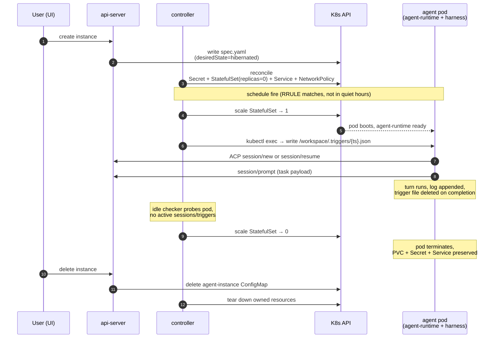

# Agent lifecycle

Last verified: 2026-04-27

## Motivated by

- [ADR-008 — Controller-owned cron with exec-based trigger delivery](../adrs/008-trigger-files.md) — schedules fire by writing JSON files into the running pod
- [ADR-012 — Runtime lifetime: single-use Jobs](../adrs/012-runtime-lifetime.md) — target model; the current prototype runs a persistent pod and migrates incrementally
- [ADR-019 — Scheduled session identity and lifecycle](../adrs/019-session-identity.md) — session-per-schedule with `session/resume` on each fire
- [ADR-023 — Harness-agnostic agent base image](../adrs/023-harness-agnostic-base-image.md) — `AGENT_COMMAND` is the only platform knob the harness sees
- [ADR-024 — Connector-declared envs and per-agent overrides](../adrs/024-connector-declared-envs.md) — env composition at pod start, restart-to-apply
- [ADR-026 — Persistent ACP sessions via per-session log](../adrs/026-session-log-replay.md) — the runtime owns the live replay log; the agent's on-disk store is the cold-start source
- [ADR-027 — Slack user impersonation](../adrs/027-slack-user-impersonation.md) — channel-driven sessions carry per-user identity; channels never reach management endpoints
- [ADR-031 — Schedules use RRULE for includes and quiet hours for exclusions](../adrs/031-schedule-rrule-quiet-hours.md) — recurrence semantics and suppression model

## Overview

An instance has two nested timescales. The **instance** is long-lived: a `agent-instance` ConfigMap exists, and its StatefulSet scales between zero and one replica as the instance hibernates and wakes. **Sessions** live inside a running pod: each ACP session is a short-lived conversation that the pod's persistent agent process serves. The lifecycle is driven by three actors:

- **Users** drive both management and sessions, but along different paths. The **UI** is the only management surface — creating, configuring, hibernating, and deleting instances all flow through tRPC on the api-server's public port, which is the sole writer of `spec.yaml`. Sessions can be driven from the UI **or** from a connected channel (Slack, Telegram). Channels never hit management endpoints; they dial the api-server's ACP relay only, with identity scoped per [ADR-027](../adrs/027-slack-user-impersonation.md). Channel internals live on [channels](channels.md).
- The **controller's schedule loop** fires triggers on RRULE occurrences and waking the pod as needed.
- The **controller's idle checker** hibernates running instances that go quiet.

## Diagram

## Phases

### Create

The api-server writes a new `agent-instance` ConfigMap with `spec.yaml` carrying the template ref, env overrides, secret refs, and a `desiredState` of `running` or `hibernated`. The controller reconciles four owned resources: a per-agent Secret (the OneCLI access token), a StatefulSet (replicas tracking `desiredState`), a headless Service, and a NetworkPolicy.

The pod image is built from `humr-base` plus a harness-specific layer ([ADR-023](../adrs/023-harness-agnostic-base-image.md)). The single platform knob is `AGENT_COMMAND` — agent-runtime spawns it as the ACP subprocess for each session and otherwise treats the harness as opaque. The workspace PVC is provisioned on first wake and survives subsequent hibernations.

Pod env at start is the composition of connector-declared envs (OneCLI app/secret registry), template envs, agent-level envs, and instance-level envs — last occurrence wins, with `PORT` server-enforced ([ADR-024](../adrs/024-connector-declared-envs.md)). Editing any of these takes effect on the next pod restart.

### Wake

`spec.desiredState` flips from `hibernated` to `running` and the controller scales the StatefulSet to one replica. Two paths trigger this:

- **Connect-driven** — the api-server is about to forward an ACP frame to a hibernated instance and wakes it before the relay completes. The frame can originate from a UI tab attaching to a session or from a channel worker (Slack / Telegram) routing an inbound message to its bound session.
- **Schedule-driven** — the controller's schedule loop is about to deliver a trigger and `kubectl exec` requires the pod to be running ([ADR-008](../adrs/008-trigger-files.md)).

Wake is bounded — the schedule loop polls pod readiness with backoff and gives up after two minutes, recording an error on the schedule's `status.yaml`.

### Trigger fire

Each `agent-schedule` runs as a per-schedule goroutine in the controller. It computes the next RRULE occurrence in the schedule's `TZID`, walks past any occurrence that falls inside an enabled quiet-hours window, and sleeps directly to the first surviving occurrence ([ADR-031](../adrs/031-schedule-rrule-quiet-hours.md)). Suppressed fires are dropped, not deferred — quiet hours mean "skip these," not "queue for later."

When a fire is due:

1. Controller wakes the instance if it is hibernated and waits for readiness.
2. Controller writes `/workspace/.triggers/{ts}.json` via `kubectl exec`. The write uses temp-file + rename so the watcher never reads a partial file.
3. The trigger watcher inside agent-runtime picks up the file, tracks it in an in-process inflight set, and opens an ACP session against the harness.
4. On completion the watcher deletes the trigger file.

Because the file is deleted on completion (not on pickup), trigger delivery is durable at-least-once: a pod crash mid-processing leaves the file on the PVC for the next boot to find ([ADR-019](../adrs/019-session-identity.md)).

#### Session continuity per schedule

The session model differs by schedule mode:

- **Fresh schedule** — every fire creates a new session via `session/new`. The schedule accumulates a list of sessions over time, browseable under the schedules tab.
- **Continuous schedule** — the first fire creates a session via `session/new`; every subsequent fire calls `session/resume` against the same session id. One schedule, one session, history retained across fires.

Schedule sessions are typed (`schedule_cron`) in the sessions DB, which is the source of truth for the schedule↔session link. The trigger watcher is just another sessions-API client over the cluster network. Triggers serialize within a schedule — if a fire arrives while the previous one is still running, the file stays on disk and is picked up on completion. Cross-schedule concurrency is unaffected.

### Session inside the pod

The harness child process runs for the pod's lifetime, not per-connection. Multiple ACP WebSocket channels (UI tabs, Slack worker, trigger watcher) attach to the same runtime concurrently and engage with sessions implicitly through the `sessionId` they carry on each frame ([ADR-026](../adrs/026-session-log-replay.md)).

Each session is an append-only in-memory log (≤2 MB soft cap, with a truncation sentinel for older history). Every channel keeps a per-session cursor; new events are appended to the log and fanned out to engaged channels at or behind the new sequence number. `session/load` is served from the log on cache hit and falls through to the agent's on-disk store on cold start.

When a session goes idle — no engaged channel, no active or queued prompt, no agent-initiated request still pending — the runtime sends `session/close` to the harness. The per-session subprocess is reaped, freeing memory; the next attach respawns it. Permission requests with no engaged channel time out after ten minutes and the runtime responds to the agent with an error so the tool call aborts cleanly.

[ADR-012](../adrs/012-runtime-lifetime.md) is the **target** lifetime model — single-use Kubernetes Jobs per turn, with a Redis-backed read cache for lightweight queries and a two-tier PVC layout (per-session + shared). Migration is on a parallel track and not blocking. The current prototype uses the persistent runtime described above.

### Hibernate

The controller's idle checker periodically scans running instances. For each, it probes the agent-runtime over the cluster network: any active sessions, any inflight triggers? If the answer is no for long enough (and the probe doesn't error), the checker flips `spec.desiredState` to `hibernated`. The reconciler then scales the StatefulSet to zero.

The pod terminates; the PVC, Secret, Service, and NetworkPolicy persist. Workspace state survives — the git checkout, `node_modules`, `.venv`, mise cache, and `$HOME` are all on the PVC and rejoin on the next wake. Anything written to the container's ephemeral filesystem (OS-level changes, tools installed outside `$HOME`) is lost; this is a deliberate constraint of the lifetime model ([ADR-012](../adrs/012-runtime-lifetime.md)).

### Delete

The api-server deletes the `agent-instance` ConfigMap. The controller's reconciler tears down the owned StatefulSet, Service, NetworkPolicy, and Secret. Sessions tied to this instance in the DB are cleaned via cascade or periodic reconciliation. PVC handling follows the cluster's reclaim policy.

Schedule ConfigMaps (`agent-schedule`) are independent resources and survive instance deletion as orphans unless the deletion path explicitly cascades. The UI offers a checkbox to delete a schedule's accumulated sessions alongside the schedule itself ([ADR-019](../adrs/019-session-identity.md)).

## Forks

An `agent-fork` ConfigMap runs a derivative of an existing instance with credential and env overrides. Unlike instances, forks reconcile to a **Kubernetes Job** rather than a StatefulSet — they run to completion and are not woken, hibernated, or kept warm. This already matches the run-to-completion shape that [ADR-012](../adrs/012-runtime-lifetime.md) targets for instances. The interesting machinery is which secrets the fork can see and how its identity propagates upstream; see [security-and-credentials](security-and-credentials.md).

