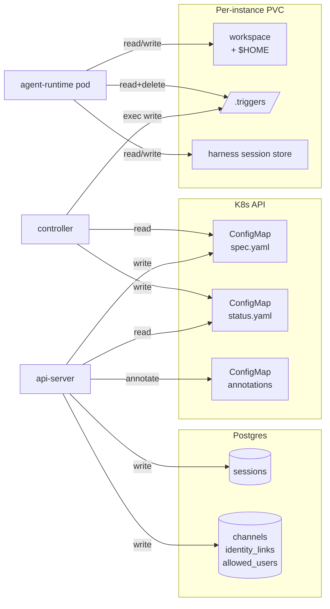

# Persistence

Last verified: 2026-04-27

## Motivated by

- [ADR-001 — Ephemeral containers + persistent workspace volumes](../adrs/001-ephemeral-containers.md) — agents are stateless processes; their state lives on PVCs that outlive the pod
- [ADR-006 — ConfigMaps over CRDs](../adrs/006-configmaps-over-crds.md) — domain resources are namespace-scoped ConfigMaps with a single-writer-per-key split
- [ADR-017 — DB-backed ACP sessions](../adrs/017-db-backed-sessions.md) — Postgres holds session metadata so the UI works even when pods are hibernated

## Overview

Humr persists state on three durable substrates, split cleanly between the platform and the agent:

**Platform-owned** (the agent never touches these):

- **Postgres** — cross-pod metadata that has to be queryable when no agent pod is running (sessions, channel bindings, identity links, allow-listed users). Sole writer: api-server.
- **ConfigMaps** — declared resource state for templates, instances, schedules, and forks, with a `spec.yaml` / `status.yaml` ownership split. Sole writer of `spec.yaml`: api-server. Sole writer of `status.yaml`: controller.

**Agent-owned**:

- **Per-instance PVCs** — the workspace and `$HOME` mounted into the agent pod. The agent process reads and writes here freely; it has no direct access to Postgres or to the ConfigMaps that describe it. Persists across hibernation; reclaimed when the instance is deleted.

The controller and api-server never share writes on the same key — write contention is impossible by convention rather than by lock. The agent's only durable surface is the PVC; everything the platform knows *about* the agent is mirrored onto Postgres or a ConfigMap by the api-server or controller, not by the agent itself.

## Diagram

## Substrates

### Postgres

Postgres is the source of truth for state the api-server must answer about *when no agent pod is running*. The largest of these is the **sessions table** ([ADR-017](../adrs/017-db-backed-sessions.md)): every ACP session is recorded here at creation time, typed by source (`regular`, `schedule_cron`, `channel_slack`, …) and linked to its owning instance. The sessions tab in the UI lists from this table directly; live ACP data (title, last update) is enriched on demand only when the pod is running.

Other tables hold cross-pod state owned by adjacent subsystems and described on their pages:

- **channel bindings** — which channel (Slack channel, Telegram thread) routes to which instance and session. See [channels](channels.md).
- **identity links** — mapping between channel-side identities and platform users for impersonation. See [security-and-credentials](security-and-credentials.md).
- **allowed users** — auth allow-list. See [security-and-credentials](security-and-credentials.md).

The api-server is the sole writer to all of these. The controller does not touch Postgres — its bookkeeping lives on `status.yaml` of the ConfigMap it owns. Schemas and migrations live in [`packages/db/`](../../packages/db/).

### ConfigMaps

Domain resources are labeled ConfigMaps ([ADR-006](../adrs/006-configmaps-over-crds.md)). Four types, distinguished by `humr.ai/type`:

| Type | What it declares |
|---|---|
| `agent` | Template: image, command, default env, mount declarations, injection rules |
| `agent-instance` | Instance: template ref, env overrides, secret refs, `desiredState` |
| `agent-schedule` | Schedule: RRULE, quiet hours, task payload, session mode |
| `agent-fork` | Forked run: parent instance ref + overrides |

Each ConfigMap carries two `data` keys with strict single-writer ownership:

- **`spec.yaml`** — user intent. Written exclusively by the api-server.
- **`status.yaml`** — observed state and scheduler bookkeeping (next fire, last fire, error). Written exclusively by the controller.

Lightweight, high-frequency metadata (`humr.ai/last-activity`, `humr.ai/active-session`) lives on **annotations** rather than `status.yaml` to avoid touching the spec/status payload on every heartbeat.

ConfigMaps were chosen over CRDs so that Humr installs without cluster-admin — the schema maps directly onto a CRD spec if the constraint ever lifts. There is no schema validation at the K8s API layer; both the api-server (on write) and the controller (on read) validate in application code.

### Per-instance PVCs

Each `agent-instance` reconciles into a StatefulSet whose `volumeClaimTemplates` are derived from the agent template's declared mounts ([ADR-001](../adrs/001-ephemeral-containers.md)). A mount marked `persist: true` becomes a PVC; a non-persisted mount becomes an `emptyDir` that dies with the pod. PVCs are `ReadWriteMany` so that forks can attach to the same workspace as their parent.

The default Claude Code template persists the workspace and `$HOME`. Together these hold:

- the **workspace** itself — git checkouts, tool caches (`node_modules`, `.venv`, mise), and any artifacts the agent has produced.
- **`$HOME`** — agent memory, skills, MCP server caches, and the harness's on-disk session store. The session store is the cold-start source for `session/load` after a pod restart.
- **`.triggers/`** — pending trigger payloads delivered by the controller. Their durability on disk is what makes scheduled trigger delivery at-least-once across pod crashes (see [agent-lifecycle](agent-lifecycle.md)).

PVCs survive hibernation — when a StatefulSet scales to zero replicas, the volume detaches but is retained. The controller explicitly deletes PVCs on instance deletion (the standard StatefulSet behavior is to retain them to prevent data loss; Humr opts back into reclamation because instance deletion is intentional).

What does **not** survive hibernation: anything written to the container's ephemeral filesystem outside the persisted mounts — OS-level changes, packages installed at runtime, files in `/tmp`. Tools and dependencies the agent relies on must be baked into the image at build time.

## Lifetime

| Event | Postgres | ConfigMap (spec/status) | PVC |
|---|---|---|---|
| Pod restart | survives | survives | survives |
| Hibernate (replicas → 0) | survives | survives | survives |
| Wake (replicas → 1) | survives | survives | survives |
| api-server restart | survives | survives | survives |
| Controller restart | survives | survives | survives |
| Instance delete | session rows removed by api-server | ConfigMap removed | PVCs removed by controller |
| Schedule delete | session rows optionally removed (UI checkbox) | ConfigMap removed | n/a |

Schedules are independent ConfigMaps and survive instance deletion as orphans unless the deletion path explicitly cascades. Sessions linked to a deleted schedule are kept by default; the UI offers a checkbox to remove them with the schedule.

## Security boundary

The PVC is a **shared mutable surface across every session, trigger, fork, and channel-driven prompt that runs on the same instance.** Anything written into the workspace by one turn — model output saved to disk, tool output, files fetched from upstream — is plain context for the next turn. Treat workspace contents as adversarial input. A scheduled job can plant a file that prompt-injects a later user-driven session; a Slack-driven prompt can leak its instructions through residue left on disk.

The platform does not sandbox writes within the workspace. Mitigations live elsewhere: NetworkPolicy restricts which upstreams the agent can reach, OneCLI gates the credentials, and forks let you run with a narrowed credential set without polluting the parent's workspace. The threat model and credential isolation are detailed on [security-and-credentials](security-and-credentials.md).
